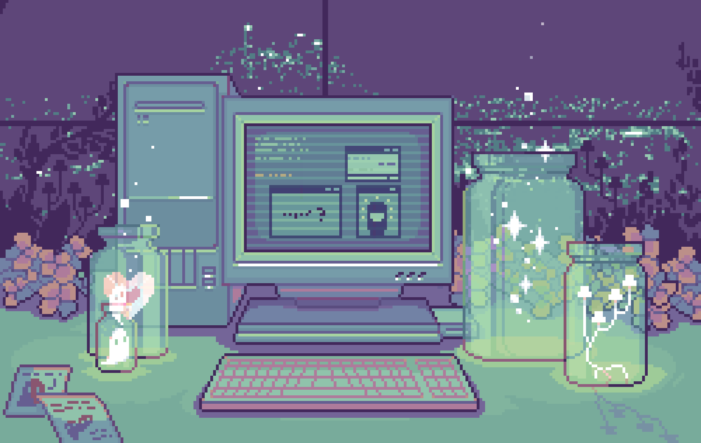

  

 

	
## <picture></picture> **About me**

<picture> </picture>

 

    <ul style="list-style: none;">
      <li>
        - 💻 I'm front-end developer in ReactJs with Typescript
      </li>
      <li>
        - 🥋 I like to practice Judo and Crosstraining
      </li>
      <li>
        - 📚 In my free time I like to read and watch series
      </li>
      <li>
        - 📝 Current Studies: English 
      </li>
      <li>
        - ✨ I am currently open for a job placement, this is my resume <a
          href="https://github.com/LarahVitoria/LarahVitoria/blob/main/CV%20EN%20-%20LARA%20VITORIA%20MACHADO%20RIBEIRO.2022.pdf">
          in English</a> and <a
          href="https://github.com/LarahVitoria/LarahVitoria/blob/main/CV%20-%20LARA%20VITORIA%20MACHADO%20RIBEIRO.2022.pdf">
          in Portuguese</a>
      </li>
    </ul>

  

  

## <b> Skills</b>
 

### Socials

  

### Badges

